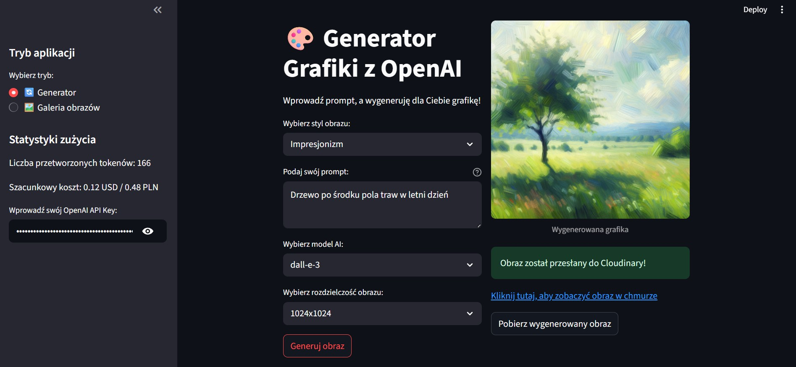
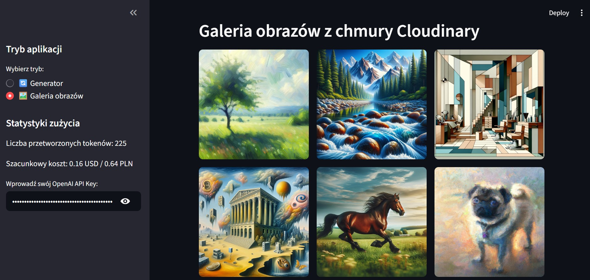

# ArtGalleryGenerator

Stworzona przeze mnie aplikcaji streamit umożliwiająca genrowanie obrazów w wybranym stylu malarskim przy pomocy modeli sztucznej inteligencji Dalle-2 lub Dalle-3. Utworzone obrazy automatycznie wysyłane są do bazy danych Cloudinary

Aplikacja pozwala również na przeglądanie wszystkich wygenerowanych obrazów

