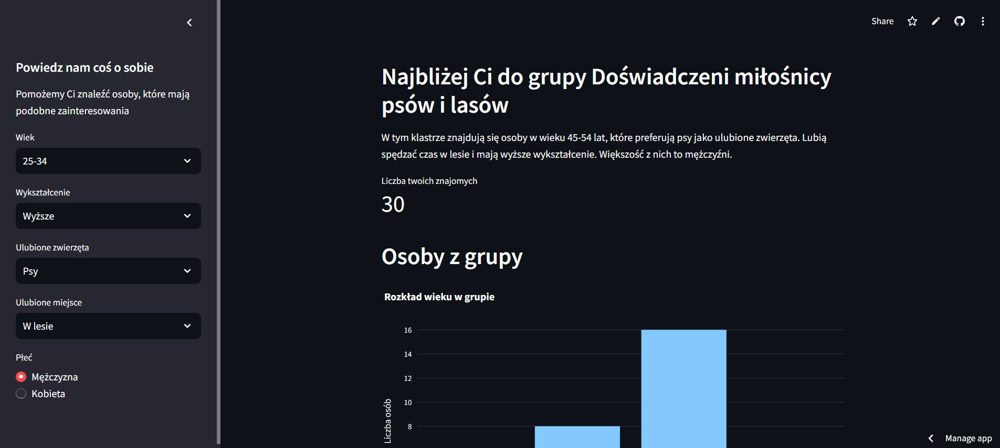

# FindFriends

Stworzona przeze mnie aplikacja do wyszukiwania osób o wspólnych zainteresowaniach. Do jej stworzenia wykorzystałem model LLM do klastrowania.

<a href="https://project71.streamlit.app/" target="_blank" rel="noopener noreferrer">Odwiedź stronę FindFriend</a>

