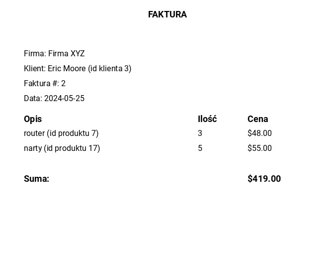
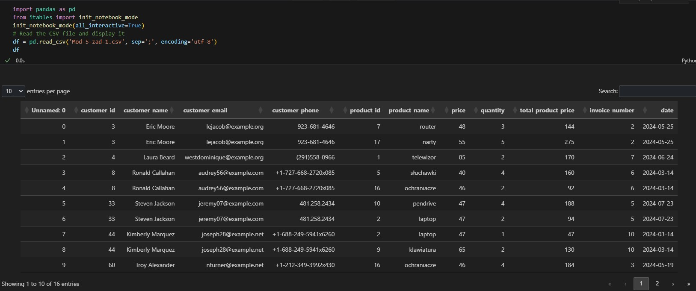
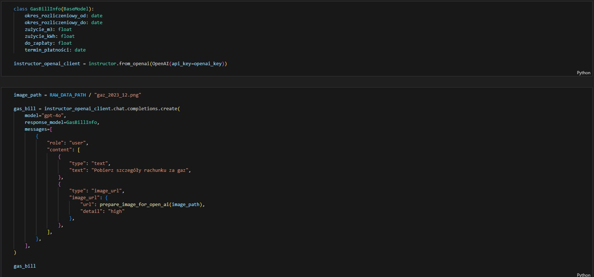

# InvoiceReader

Stworzona przeze mnie aplikacja do automatycznego odczytywania danych z faktur. Program przetwarza wszystkie pliki graficzne a następne zapisuje zbiorczo wszystkie informacje w pliku .csv

Przykładowa faktura

Zebrane dane

Wykorzystanie klasy instructor

