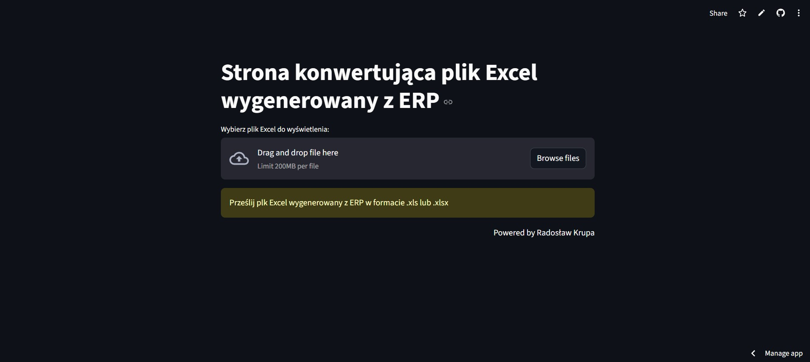

# ArtGalleryGenerator

Aplikacja wykonana przeze mnie dla firmy Temared. Konwertuje ona zablokowany do edycji magazynowy raport ERP do formatu .xlsx o wymaganym układzie danych co pozwala na automatycznie zaczytywanie informacji do szybkiego generowania wykresów u osób kierujących magazynem i analizę danych w czasie rzeczywistym.

<a href="https://radoxan-konwertowanie-danych-z-erp-karolkonwerter-nixntw.streamlit.app/" target="_blank" rel="noopener noreferrer">Odwiedź stronę KonwerterERP</a>

