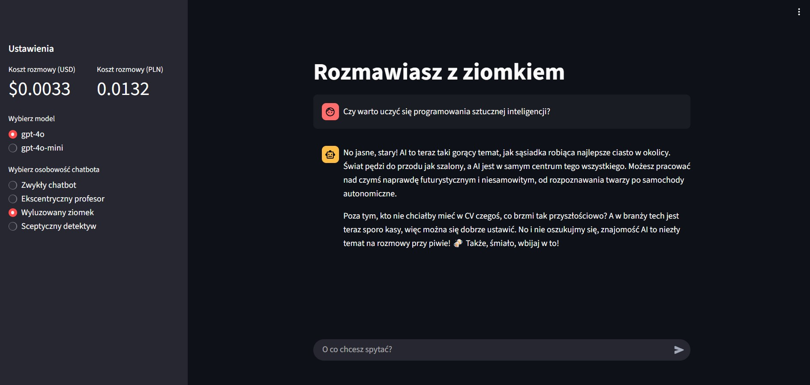

# ArtGalleryGenerator

Aplikacja pozwala na rozmowę ze stworzonym przeze mnie ChatBotem. Aplikacja pozwalana na ustawienie charakteru bota tak, jakby naszym rozmówcą był detektyw, profesor lub wyluzowany znajomy. Aplikacja pozwalna na wybór modelu OpenAi oraz potrafio oszacować koszt użycia modelu.

