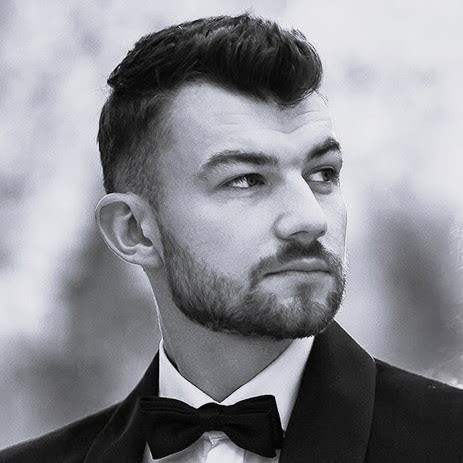

# Cześć tu Radek. Witaj w moim portfolio!

  

Nazywam się Radosław Krupa. Pochodzę z małej miejsowości pod Lublinem. 
Odkąd pamiętam miałem zamiłowanie do matematyki, fizyki, sportu oraz zawsze intygowały mnie najnowsze technologie i sposób ich działania. Z fascynacją obserwuję jak rozwija się sztuczna inteligencja i jakie możliwości nam daje. Napędza świat, który rozwija się szybciej niż kiedykolwiek a ja nie mogę doczekać się efektów do których nas poprowadzi. 
Na tej stronie prezentuję moje dotychczasowe projekty związane z programowaniem, analizą danych!

Na tej stronie znajdziesz moje projekty związane z programowaniem i analizą danych.

### 📚 Kursy

| Kurs          | Organizator | Rok  |
|---------------|-------------|------|
| Od zera do AI | Gotoit      | 2025 |

### 🧠 Technologie
- 🐍 Python
- 🗃️ SQL
- 📊 Pandas, Matplotlib, Seaborn
- 🤖 PyTorch, Scikit-learn
- 🌐 Streamlit

### 🧰 Biblioteki i narzędzia
- 📊 Pandas
- 🧪 PyCaret
- 🌐 Streamlit
- 📈 Matplotlib
- 🎨 Seaborn
- 📉 Plotly
- ➕ NumPy
- 🧠 Scikit-learn
- 🔥 PyTorch
- 🖼️ Tkinter
- 🕸️ BeautifulSoup
- 🌐 Requests
- 🤖 OpenAI API
- 🔗 LangChain
- 🧾 Pydanti

### 🧩 Inne
- 🗂️ Git
- 🧠 Visual Studio Code
- 📓 Jupyter
- ☁️ DigitalOcean
- 🐳 Docke

### 📬 Kontakt

[Mój GitHub](https://github.com/radoxan)

[Mój Linkedin](https://www.linkedin.com/in/radoslaw-krupa/)

    Napisz do mnie na [radekkrupa96@gmail.com]